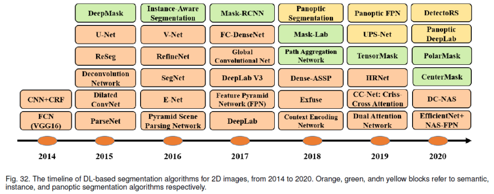

# Segmentations notes

## Lectures 
* [edwith: 컴퓨터비전, 머신러닝, 딥러닝을 이용한 의료영상분석](https://www.edwith.org/medical-20200327/lecture/63166/)

## History

 https://arxiv.org/pdf/1906.11172.pdf

### Loss

#### Dice coefficient

dice coefficient는 주로 medical image analysis에서 사용됩니다. 그리고 예측값과 gt 사이의 overlap area에 2를 곱하고 예측값과 gt 영역을 합한 것으로 나눠줍니다. 이는 IoU와 매우 유사합니다.

$$ dice = \frac{2|A \cap B }{|A| + |B|}$$
 
Dice를 boolean data(binary segmentation map)에 적용할 때, Dice coefficient는 F1 score와 동일합니다.
$$ dice = \frac{2TP}{2TP + FP + FN}$$
