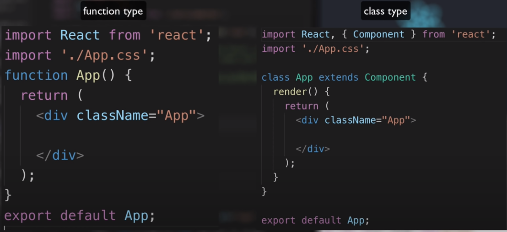

# React 


## Install 
* install [nodejs](https://github.com/nodesource/distributions)
    * 해당 사이트에서 nvm 설치릏 하고, 원하는 version에 맞추어 node를 설치한다.
        ```
        nvm install <version e.g. 12.0.0>
        ```

* install npm
    ubuntu에서 다음과 같이 기본적으로 `pypl (pip install npm)`으로 설치하는 경우에는 버전이 오래될 수 있기 때문에 [nvm](https://github.com/nvm-sh/nvm)을 설치하자

* install developing tool

    chrome을 사용하면, react developer tool을 설치하여 실제로 web에 띄운 내용을 html이 아니라 react로 보면서 어떻게 적용이 되는지 확인할 수 있다. 

## Create a project

* create-react-app
    공식적으로는 `npx create-react-app`를 이용해서 project를 생성할수 있고, `npm`으로도 가능하다. <br/>
    `npm`는 프로그램을 설치하는 명령어로 다음과 같이 `create-react-app`이라는 프로그램을 먼저 설치하고 원하는 react project를 생성하는 것이다. 반면에, `npx`는 `create-react-app`이라는 프로그램을 한번만 설치하여 project를 생성하고, 지우는 명령어이다. 그렇기 때문에 컴퓨터의 공간을 낭비하지 않으며, 실행할 때마다 설치하기 때문에 항상 최신버전의 `create-react-app`으로 project를 관리할 수 있다. 
    
    * `npx`으로 project 생성
        ```
        npx create-react-app [project name]
        ```
    <br/>
    * `npm`으로 project 생성
        ```
        sudo npm install create-react-app
        cd ~/<project dir.>
        create-react-app .
        ```
    <br/>
    * 버전 확인
        ```
        create-react-app -V
        ```
    <br/>
    * 개발하기 위한 실행 
        ```
        npm run start
        ```
    <br/>
    * 배포하는 법
        ```
        npm run build
        ```

        `build`라는 폴더가 생기는데 이 곳에 개발한 웹사이트가 `production`으로서 필요한 모든 내용이 들어가 있게 되고, 이를 활용하여 다음과 같이 배포가 가능하다. 

        ```
        npm install -g serve
        serve -s build 
        ```
        <br/>
        새로고침을 마우스 오른쪽으로 클릭하면 `Empy cache and Hard reload`를 통해서 `build`로 배포한 경우에는 `create-react-app`으로 배포한 경우보다 용량이 상당히 줄어들었음을 확인할 수 있다.

    
## Keypoints

* **Component**라는 인스턴스를 통해서 좀 더 쉽고 용이하게 frontend를 개발할 수 있도록 해주는 도구(?)로서, 기존의 방식보다 재사용성, 가독성 등의 이점을 갖는다.

* 기본적인 pipeline은 `public/indext.html` -> `App.js` -> `src/index.js`로 연동되면서 화면에 출력 

* 코드를 작성하는 데에 있어서는 `function type`과 `class type`이 존재


* `Component`내에서는 하나의 최상위 `tag`만 사용해야 한다. 

* React는 javascript를 사용하는 게 아니라, 유사하지만 보다 편리한 방식의 JSX를 사용한다.

* **props**: 하위 component가 상위 component의 데이터를 활용할 때
    * read-only: but! event를 통해서 하위가 상위의 데이터를 변경 가능

* **state**: 상위 component가 하위 component의 데이터를 활용할 때 (내부적으로)
    * `setState({})`

* **event**
    * `e.preventDefault()`: `props`와 `state`는 `render()`함수를 유발하기 때문에 부분적인 새로고침을 위한 함수

* **redux**

* Immutable

* router

* npm run eject

* react server side rendering

* react native

## Useful tutorials

* https://www.youtube.com/watch?v=dvQMbg7n6mY&list=PLZKTXPmaJk8J_fHAzPLH8CJ_HO_M33e7-&index=2
* https://www.youtube.com/watch?v=AODd4CjE1h8&list=PLB7CpjPWqHOuf62H44TMkMIsqfkIzcEcX&index=2
