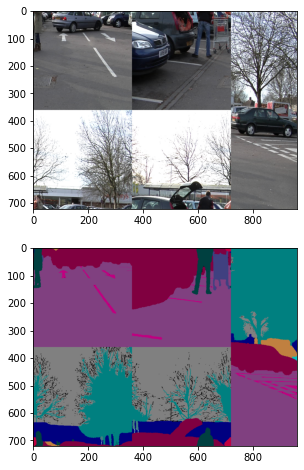

```python
import os.path as osp 
import glob
import matplotlib.pyplot as plt
import albumentations as A
import cv2
```


```python
def visualize(image, mask, original_image=None, original_mask=None):
    fontsize = 18
    
    if original_image is None and original_mask is None:
        f, ax = plt.subplots(2, 1, figsize=(8, 8))

        ax[0].imshow(image)
        ax[1].imshow(mask)
    else:
        f, ax = plt.subplots(2, 2, figsize=(8, 8))

        ax[0, 0].imshow(original_image)
        ax[0, 0].set_title('Original image', fontsize=fontsize)
        
        ax[1, 0].imshow(original_mask)
        ax[1, 0].set_title('Original mask', fontsize=fontsize)
        
        ax[0, 1].imshow(image)
        ax[0, 1].set_title('Transformed image', fontsize=fontsize)
        
        ax[1, 1].imshow(mask)
        ax[1, 1].set_title('Transformed mask', fontsize=fontsize)
```


```python
fp = "/home/wonchul/mnt/HDD/datasets/public/camvid/archive/CamVid"
img_files = sorted(glob.glob(osp.join(fp, "test/*.png")))
mask_files = sorted(glob.glob(osp.join(fp, "test_labels/*.png")))

print(len(img_files), len(mask_files))
```

    232 232


```python
idx = 100
image = cv2.imread(img_files[idx])
image = cv2.cvtColor(image, cv2.COLOR_BGR2RGB)
mask = cv2.imread(mask_files[idx])

print(image.shape)
visualize(image, mask)
```

    (720, 960, 3)


    

    


```python
def diagonal_reverse(img, **kwargs):
    
    transformed_img = img.copy()
    center = img.shape[0] // 2
    transformed_img[0:center, 0:center] = img[center:center + center, center:center + center]
    transformed_img[0:center, center:center + center]  = img[center:center*2, 0:center]
    transformed_img[center:center + center, 0:center] = img[0:center, center:center*2]
    transformed_img[center:center + center, center:center + center] = img[0:center, 0:center]
    
    print(kwargs)
    
    return transformed_img
```


```python
transform = A.Compose([
#     DiagonalReverse(p=1.0)
    A.Lambda(image=diagonal_reverse, mask=diagonal_reverse)
])

```


```python
transformed = transform(image=image, mask=mask)
```

    {'cols': 960, 'rows': 720}
    {'cols': 960, 'rows': 720}


```python
visualize(transformed['image'], transformed['mask'])
```


    

    


