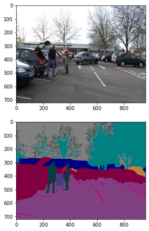
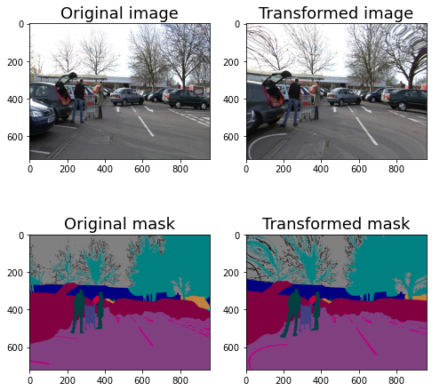
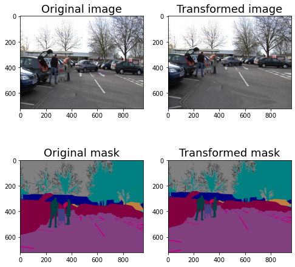
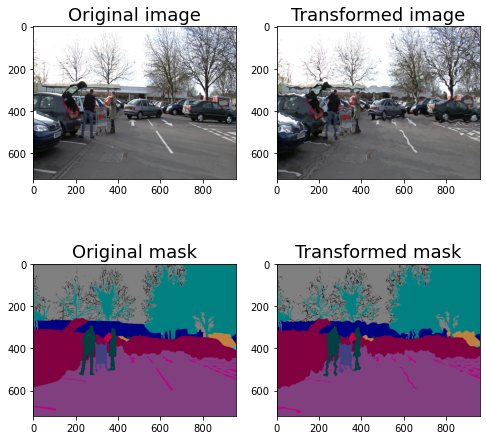
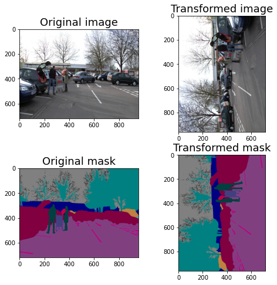
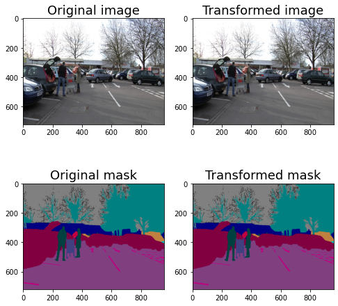
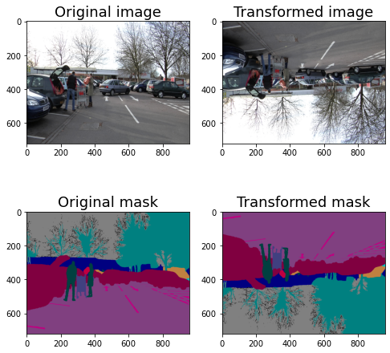
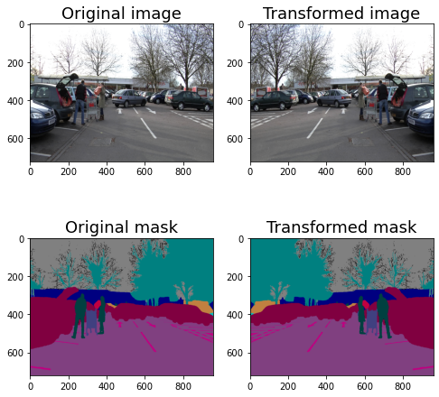

https://albumentations.ai/docs/examples/example_kaggle_salt/


```python
import os.path as osp 
import glob
import matplotlib.pyplot as plt
import albumentations as A
import cv2
```


```python
def visualize(image, mask, original_image=None, original_mask=None):
    fontsize = 18
    
    if original_image is None and original_mask is None:
        f, ax = plt.subplots(2, 1, figsize=(8, 8))

        ax[0].imshow(image)
        ax[1].imshow(mask)
    else:
        f, ax = plt.subplots(2, 2, figsize=(8, 8))

        ax[0, 0].imshow(original_image)
        ax[0, 0].set_title('Original image', fontsize=fontsize)
        
        ax[1, 0].imshow(original_mask)
        ax[1, 0].set_title('Original mask', fontsize=fontsize)
        
        ax[0, 1].imshow(image)
        ax[0, 1].set_title('Transformed image', fontsize=fontsize)
        
        ax[1, 1].imshow(mask)
        ax[1, 1].set_title('Transformed mask', fontsize=fontsize)
```


```python
fp = "/home/wonchul/mnt/HDD/datasets/public/camvid/archive/CamVid"
img_files = sorted(glob.glob(osp.join(fp, "test/*.png")))
mask_files = sorted(glob.glob(osp.join(fp, "test_labels/*.png")))

print(len(img_files), len(mask_files))
```

    232 232


```python
idx = 100
image = cv2.imread(img_files[idx])
image = cv2.cvtColor(image, cv2.COLOR_BGR2RGB)
mask = cv2.imread(mask_files[idx])

print(image.shape)
visualize(image, mask)
```

    (720, 960, 3)


    

    


```python
transform = A.Compose(
    A.OpticalDistortion(distort_limit=2, shift_limit=0.5, p=1)
)

transformed = transform(image=image, mask=mask)
transformed_image = transformed['image']
transformed_mask = transformed['mask']

print(image.shape, mask.shape)
print(transformed_image.shape, transformed_mask.shape)
visualize(transformed_image, transformed_mask, original_image=image, original_mask=mask)

```

    /home/wonchul/anaconda3/lib/python3.9/site-packages/albumentations/core/composition.py:53: UserWarning: transforms is single transform, but a sequence is expected! Transform will be wrapped into list.
      warnings.warn(


    (720, 960, 3) (720, 960, 3)
    (720, 960, 3) (720, 960, 3)


    

    


```python
transform = A.Compose(
    A.GridDistortion(p=1)
)

transformed = transform(image=image, mask=mask)
transformed_image = transformed['image']
transformed_mask = transformed['mask']

print(image.shape, mask.shape)
print(transformed_image.shape, transformed_mask.shape)
visualize(transformed_image, transformed_mask, original_image=image, original_mask=mask)

```

    (720, 960, 3) (720, 960, 3)
    (720, 960, 3) (720, 960, 3)


    

    


```python
transform = A.Compose(
    A.ElasticTransform(p=1, alpha=120, sigma=120 * 0.05, alpha_affine=120 * 0.03)
)

transformed = transform(image=image, mask=mask)
transformed_image = transformed['image']
transformed_mask = transformed['mask']

print(image.shape, mask.shape)
print(transformed_image.shape, transformed_mask.shape)
visualize(transformed_image, transformed_mask, original_image=image, original_mask=mask)

```

    (720, 960, 3) (720, 960, 3)
    (720, 960, 3) (720, 960, 3)


    

    


#### Non-rigid transformations: ElasticTransform, GridDistortion, OpticalDistortion

In medical imaging problems, non-rigid transformations help to augment the data. It is unclear if they will help with this problem, but let's look at them. We will consider ElasticTransform, GridDistortion, OpticalDistortion.

We fix the random seed for visualization purposes, so the augmentation will always produce the same result. In a real computer vision pipeline, you shouldn't fix the random seed before applying a transform to the image because, in that case, the pipeline will always output the same image. The purpose of image augmentation is to use different transformations each time.


```python
transform = A.Compose(
    A.Transpose(p=1)
)

transformed = transform(image=image, mask=mask)
transformed_image = transformed['image']
transformed_mask = transformed['mask']

print(image.shape, mask.shape)
print(transformed_image.shape, transformed_mask.shape)
visualize(transformed_image, transformed_mask, original_image=image, original_mask=mask)

```

    (720, 960, 3) (720, 960, 3)
    (960, 720, 3) (960, 720, 3)


    

    


```python
transform = A.Compose(
    A.RandomRotate90(p=1)
)

transformed = transform(image=image, mask=mask)
transformed_image = transformed['image']
transformed_mask = transformed['mask']

print(image.shape, mask.shape)
print(transformed_image.shape, transformed_mask.shape)
visualize(transformed_image, transformed_mask, original_image=image, original_mask=mask)

```

    (720, 960, 3) (720, 960, 3)
    (720, 960, 3) (720, 960, 3)


    

    


```python
transform = A.Compose(
    A.VerticalFlip(p=1)
)

transformed = transform(image=image, mask=mask)
transformed_image = transformed['image']
transformed_mask = transformed['mask']

print(image.shape, mask.shape)
print(transformed_image.shape, transformed_mask.shape)
visualize(transformed_image, transformed_mask, original_image=image, original_mask=mask)

```

    (720, 960, 3) (720, 960, 3)
    (720, 960, 3) (720, 960, 3)


    

    


```python
transform = A.Compose(
    A.HorizontalFlip(p=1)
)

transformed = transform(image=image, mask=mask)
transformed_image = transformed['image']
transformed_mask = transformed['mask']

print(image.shape, mask.shape)
print(transformed_image.shape, transformed_mask.shape)
visualize(transformed_image, transformed_mask, original_image=image, original_mask=mask)

```

    (720, 960, 3) (720, 960, 3)
    (720, 960, 3) (720, 960, 3)


    

    


```python

```


```python

```


```python

```
