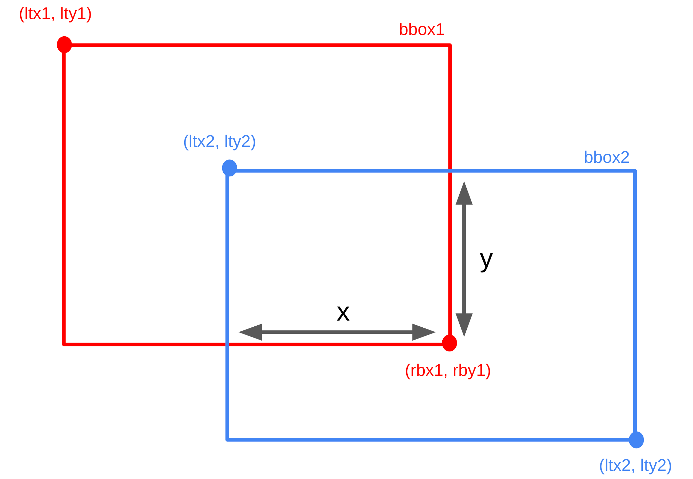

1. IoU of tow rectangles without rotation

    

    ```python
    area_bbox1 = (rbx1 - ltx1)*(rby1 - lty1)
    area_bbox2 = (rbx2 - ltx2)*(rby2 - lty2)

    intersection_x = min(rbx1, rbx2) - max(ltx1, ltx2)
    intersection_y = min(rby1, rby2) - max(lty1, lty2)
    intersection_area = intersection_x*intersection_y

    iou = intersection_area / (area_bbox1 + area_bbox2 - intersection_area)
    ```


2. 
