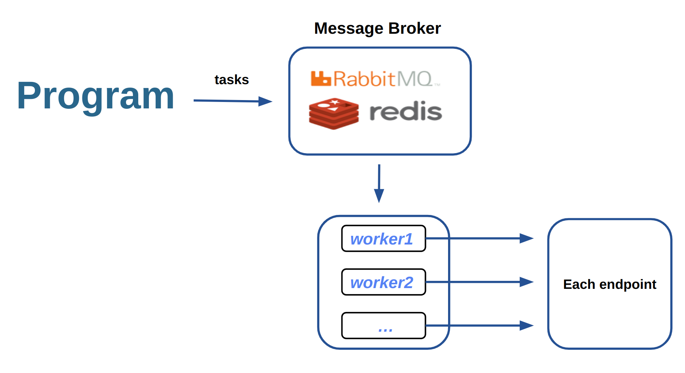

## Celery

`celery`는 즉각적인 반응을 보여줄 필요가 없는 작업들을 비동기적 작업 큐(asynchronous task/job queue)를 통해서 back단에서 처리하도록 하여, 메인 프로그램에서의 delay가 없도록 해준다. 즉, 메인 프로그램은 실시간 처리에 중점을 두도록 하고, 그 외에 메인 프로그램에 영향을 미치지 않는 작업은 Queue에 쌓아여 `celery worker`가 수행하도록 하는 것이다.

주로 `Django` 등과 같은 웹 서비스 프레임워크에서 사용자 요청에 따른 즉각적인 응답이 필요없고, 작업의 시간도 오래 걸리는 서비스가 있는데, 가입 축하 이메일 발송, 주문 내역 엑셀 다운로드 등의 불필요한 과정이나 매우 무거원 쿼리 실행을 포함하는 경우가 있다. 이 API에 포함된 외부 연동이나 무거운 작업들은 `celery`로 처리하여 사용자에게 있어서는 서비스를 이용하는 데에 불편함이 없도록 한다. 

전체적인 프로세스는 아래와 같다. 

메인 프로그램에서 `task`를 `Message broker`에게 넘기고, `celery worker`에서 `Queue`에 쌓이 `task`를 처리하도록 한다. 

* `Message broker`: 프로그램에서 명령 내린 `task`를 각 `celery worker`에게 전달하기 위한 중간 역할을 하며, `RabbitMQ`, `Redis` 등의 라이브러리가 주로 사용되고 있다. 

* `worker`: 웹 서비스에서 back단의 작업을 처리하는 별도의 프레임으로, `message broker`에서 메세지를 가져와 작업을 수행한다. 

#### celery 특징

* `Client`나 `Worker`는 연결 유실이나 실패에 대해 자동으로 재시도 합니다. 또한 `Broker`, `Worker`를 HA 구성하여 고가용성이 뛰어납니다.

* 단일 `Celery` 프로세스는 최적화 설정(`RabbitMQ`, `librabbitmq` 등)을 통해 밀리 초 정도의 대기 시간으로 분당 수백만 개의 작업을 처리 할 수 있을 정도로 빠릅니다.

* `Celery`는 확장성이 매우 뛰어나 거의 모든 부분을 커스텀하여 사용할 수 있습니다. (사용자 지정 풀 구현, `serializer`, `compression schemes`, `logging`, `schedulers`, `consumers`, `producers`, `broker transports` 등.)

### references

- https://docs.celeryq.dev/en/latest/getting-started/first-steps-with-celery.html