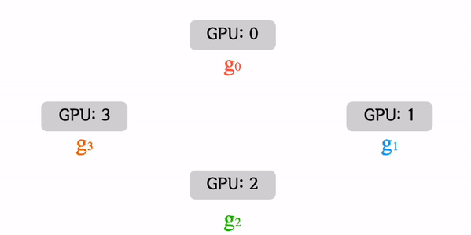
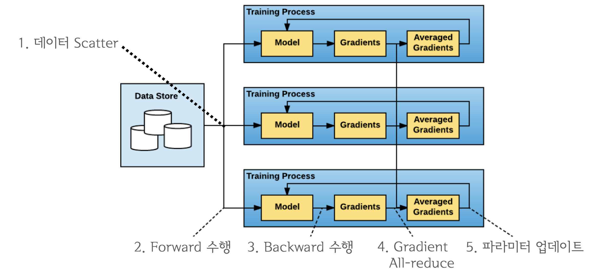
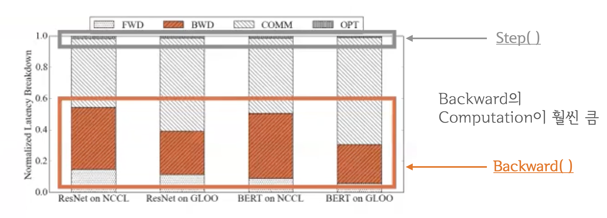
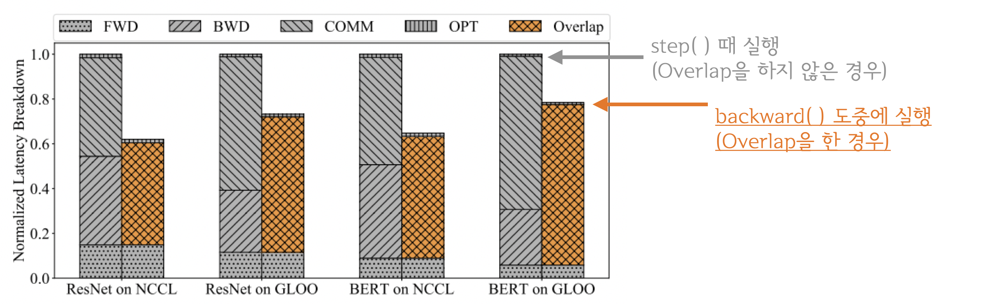
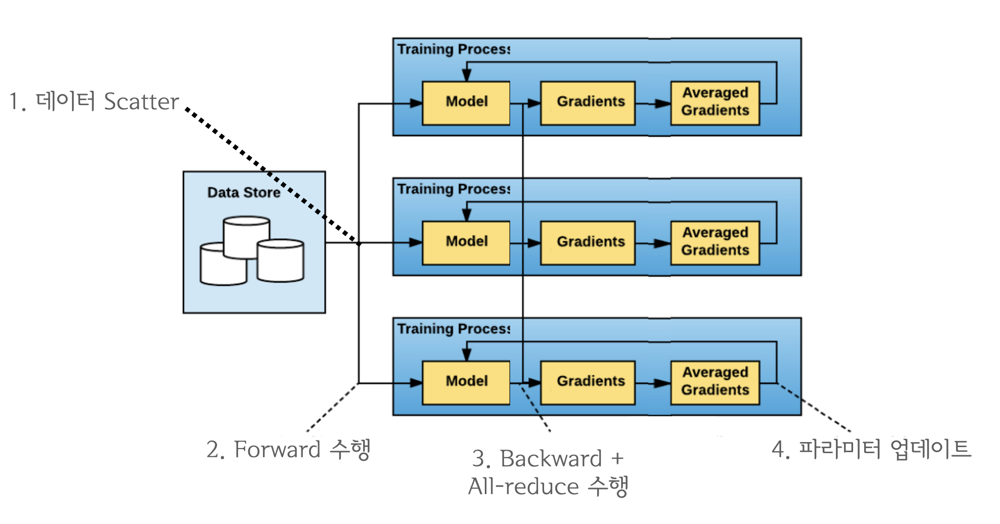
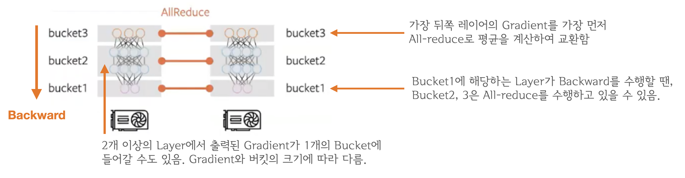

## `torch.nn.parallel.DistributedDataParallel`

#### [Ring All-reduce ](https://github.com/baidu-research/baidu-allreduce)

**Ring All-reduce**는 **DDP**의 개발에 핵심이 된 이론으로

- master device의 개념이 없음
- 각 device로의 replicate가 없음

**DDP**는 기존의 **DP**의 문제점을 해결하면서, **single/multi node에서 multi-GPUs**로 동작할 수 있다. 

### All-reduce를 언제 수행!?

All-reduce는 네트워크 통신이고, `backward()`와 `step()`은 GPU 연산이기 때문에 동시에 처리가 가능하다.

먼저 아래의 그림을 보면, `backward()`가 `step()`보다 훨신 큰 연산이다. 

그렇기 때문에 `backward()`가 끝날 때까지 기다리기 보다는 함께 처리하는 것이 더 효율적이며, 아래처럼 latency를 줄일 수 있다. 

결과적으로는 아래와 같이 수행된다.

좀 더 자세히 들어가면, 

#### Gradient Bucketing

> Q1: backward() 연산 중에 Gradient가 모두 계산되지 않았는데 어떻게 all-reduce를 수행합니까?
> A1: backward()는 뒤쪽 레이어부터 순차적으로 이루어지기 때문에 계산이 끝난 레이어 먼저 전송하면 됩니다.

> Q2: 그렇다면 언제마다 all-reduce를 수행하나요? 레이어마다 이루어지나요?
> A2: 아닙니다. Gradient Bucketing을 수행합니다. Bucket이 가득차면 All-reduce를 수행합니다

Gradient Bucekting는 Gradient를 일정한 사이즈의 bucket에 저장해두고 가득차면 다른 프로세스로 전송하는 방식입니다. 가장 먼저 backward() 연산 도중 뒤쪽부터 계산된 Gradient들을 차례대로 bucket에 저장하다가 bucket의 용량이 가득차면 All-reduce를 수행해서 각 device에 Gradient의 합을 전달합니다. 그림 때문에 헷갈릴 수도 있는데, bucket에 저장되는 것은 모델의 파라미터가 아닌 해당 레이어에서 출력된 Gradient입니다. 모든 bucket은 일정한 사이즈를 가지고 있으며 bucket_size_mb 인자를 통해 mega-byte 단위로 용량을 설정 할 수 있습니다.

