# [Attention Is All You Need](https://arxiv.org/abs/1706.03762)

- 전과 달리 RNN을 사용하지 않고도, Faster & Better!
- `Self Attention`,`Multi Head Attention`,`Positional Encoding`,`Position Wise FFNN`,`Residual Connection Layer`,`Layer Normalization`, ...

### Problem: 
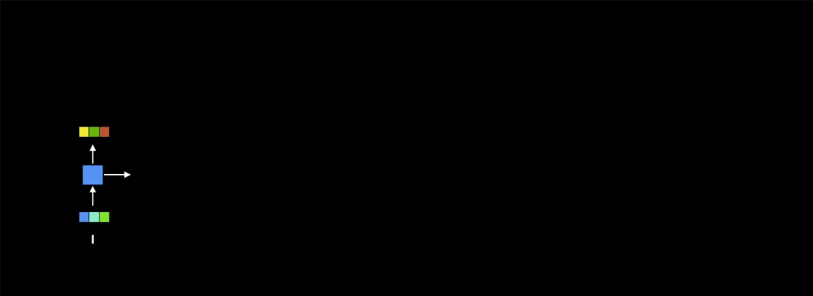


{:class="img-responsive"}

1. `RNN`으로 인해서 지속적으로 `encoder`의 `state`에 대한 모든 처리가 순차적으로 필요한 `seq2seq` 개념으로 계산 속도가 느림.

2. `attetion`을 활용한다고 하더라도 일부 정보만을 이용하여 연산을 하는 것이기 때문에 정보 손실이 발생하며, 입력값이 긴 경우에는 더욱이 영향을 받음.

### Solution: 
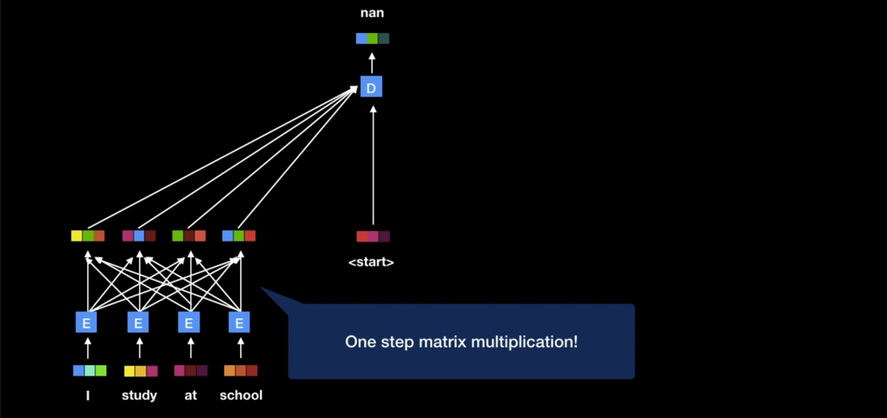

1. `encoder`와 `decoder`에서 `RNN`을 사용하지 않고, 행렬 곱을 활용하여 parallel하게 모든 `state`에 대한 처리를 한 번에 하도록 함

    - 이 때, `Positional encoding`을 통해서 문장에서의 단어에 **상대적인** 순서를 매칭 

    - `encoder`와 `decoder`의 역할은 동일하며, 특히 `decoder`의 번역과정은 기존과 동일하게 `<start>`에서 `<end>`로 순차적으로 `state`를 생성함

2. `Self attention`이라는 개념을 적용: 말 그대로 자신에 대해서 중요도를 판단하는 것으로 다음과 같이 표현이 가능하며, 사이즈가 변하지 않는다는 특징이 있다. 

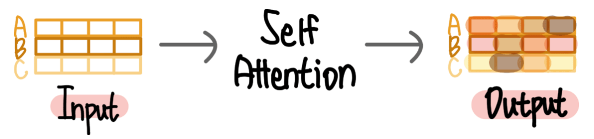


### `Transformer`

#### `Self Attention`

- `Query`, `Key`, `Value`의 vector로 계산

    `attention`을 하되 `self`라는 의미 그대로 자기 자신과의 상관관게에서의 유사성을 계산하는 것이고, 그렇기 때문에 `Query`, `Key`, `Value`가 모두 **동일한 input**으로부터의 linear projection된 값이다. 


    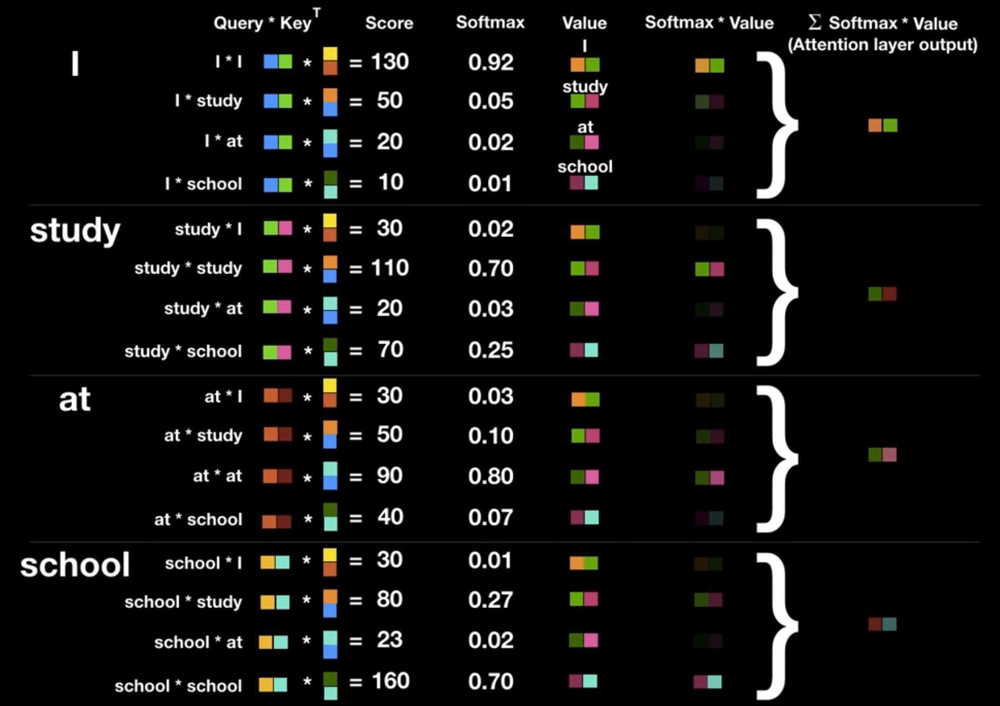

    - `Query`: 현재 단어

    - `Key`: 알고자하는 상관관계의 단어

        > 이 둘의 attention score가 높을수록 두 단어의 상관관계가 많다는 것

    - `Value`: attention score를 곱해야 하는 값으로 `Query`와 동일하다.

- 위의 계산은 행렬 곱으로 다음과 같이 `vector`로 만들어서 한번에 계산이 가능하다. 

    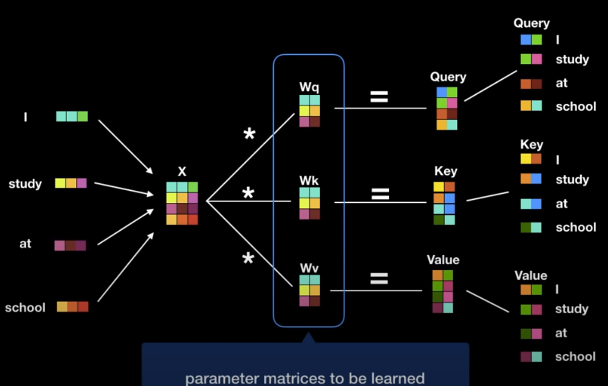

- 위의 `Attention` layer를 병렬처리하면, 다음과 같다.

    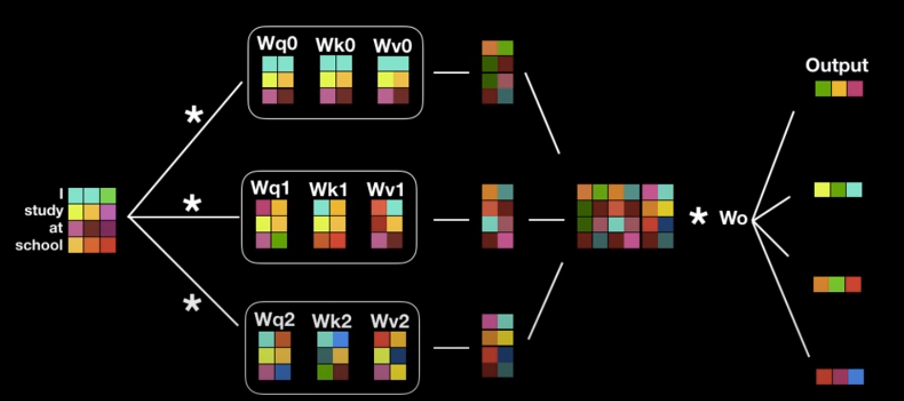

- 기존의 `RNN`과 `attention`을 활용한 기법에서의 `attention`은 `RNN`의 hidden state를 `Key`로 하여 attetion score를 구하였지만, `self attention`은 input 자체의 문맥에서 attention score를 구한다. 

    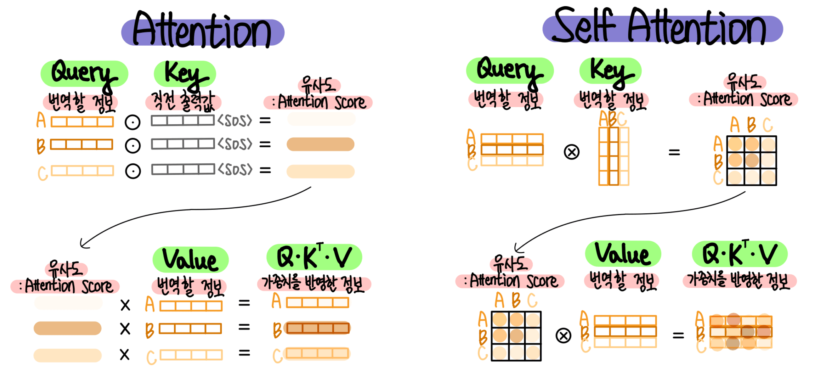


- 간단하게 구현하면, 
    ```python

    class SelfAttention(nn.Module):
        def __init__(self, embed_dim):
            super().__init__()
            self.embed_dim = embed_dim # (input_dim, output_dim)

            self.query = nn.Linear(self.embed_dim, self.embed_dim, bias=False)
            self.key = nn.Linear(self.embed_dim, self.embed_dim, bias=False)
            self.value = nn.Linear(self.embed_dim, self.embed_dim, bias=False)

            self.fc_out = nn.Linear(self.embed_dim, self.embed_dim)

        def forward(self, query, key, value):
            query = self.query(query)
            key = self.key(key)
            value = self.value(value)

            attetion_score = F.softmax(torch.matmul(query, key.transpose(0, 1)), dim=1)

            out = torch.matmul(attention_score, value)
            out = self.fc_out(out)

            return out
    ```

#### `Multi Head Attention`


`Self attention`은 입력과 출력의 dimension이 변하지 않기 때문에 위와 같이 module로서 여러 개 연결이 가능하고, 이렇게 여러 개의 `self attention`을 연결하여 사용하는 구조를 `multi head attention`이라고 하며, 논무에서는 이러한 `multi head attention`을 6개 연결한 하여 `transformer`로 구성한다.

> 이 때, weights는 서로 공유하지 않는다!

#### `Positional Encoding`

자연어 처리에서 입력값에 대해서 순서가 매우 중요하고 `RNN`이 빈번히 사용되었던 것이다. 하지만, `transformer`는 입력값에 대해서 행렬로 한 번에 처리하기 때문에 순서에 대한 정보는 신경쓰지 않으며, 이를 `permutation invariance`라고 한다. 그렇기 때문에 위치정보를 주기 위해서 `positional encoding`을 사용하며, Sin과 Cosine 함수를 조합하여 도출한다. 

#### `Position Wise FFNN (Feed Forward Neural Network)`

`Self attention`의 결과에 대해서 non-linearity를 추가하기 위한 연산으로 다음과 같다 
$$
FFN(x) = max(0, xW_1 + b_1)W_2 + b_2
$$

#### `Residual Connection`

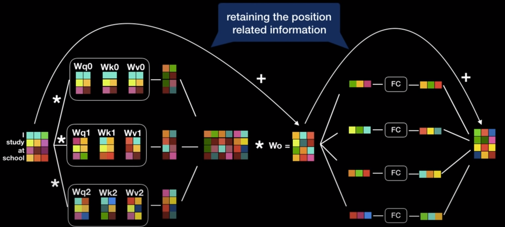

`ResNet`에서 제안한 것처럼 이전 값을 전달해주는 기법이다. 

#### `Layer Normalization`

`Batch normalization`이 batch를 단위로 해서 mean/std를 통해서 normalization을 하는 것이라면, `layer normalization`은 각 데이터를 기준으로 normalization을 수행한다. 

```python
X = np.array([[1, 2], [3, 4], [5, 6]])

# Batch Normalization
mean_batch = np.mean(X, axis=0)
var_batch = np.var(X, axis=0)
X_norm_batch = (X - mean_batch) / np.sqrt(var_batch + 1e-8)

# Layer Normalization
mean_layer = np.mean(X, axis=1, keepdims=True)
var_layer = np.var(X, axis=1, keepdims=True)
X_norm_layer = (X - mean_layer) / np.sqrt(var_layer + 1e-8)
```

#### `Decoder`

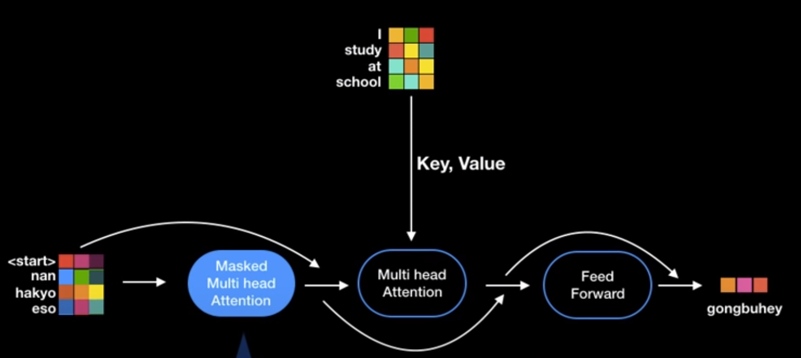

#### `Masked Multi Head Attention`

`Decoder`는 입력과 출력 데이터를 동시에 사용하는데, 지금까지 출력된 값에 대해서만 `attention`이 적용되고 나머지에 대해서는 masking을 처리한다. 

#### `Croess Self Attention`

`Decoder`에서의 `multi head attention`은 엄밀히 말하면, `self attention`은 아니다. (예를 들어, `Query`와 `Key`는 번역할 정보로, `Value`는 번역된 정보로 구성)

- `Query`: `decoder`의 입력값
- `Key` & `Value`: `encoder`의 최종 출력값 

#### `Header`

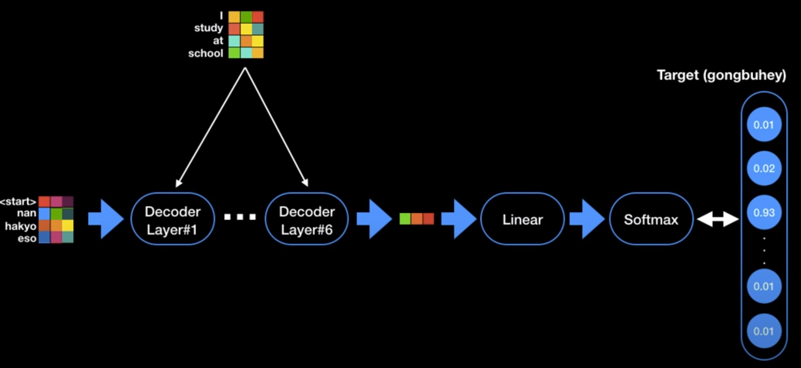

`decoder`의 출력값을 적절한 단어로 바꾸기 위해서 `header`가 필요

- `label smoothing` 적용하여 BLEU score와 accuracy를 개선

    > 이는 학습 데이터가 매우 깔끔하여 예측해야하는 값이 확실하다면 성능에 영향이 없지만, 그렇지 못한 경우에는 영향이 크다. 예를 들어, 'Thank you'에 대해서 '고마워'와 '감사합니' 모두 올바른 예측값이 되고 `label smoothing`을 사용하면 이 두 예측값에 대한 vector의 차이를 줄일 수 있어 성능에 영향을 미친다.

#### `Decoder`

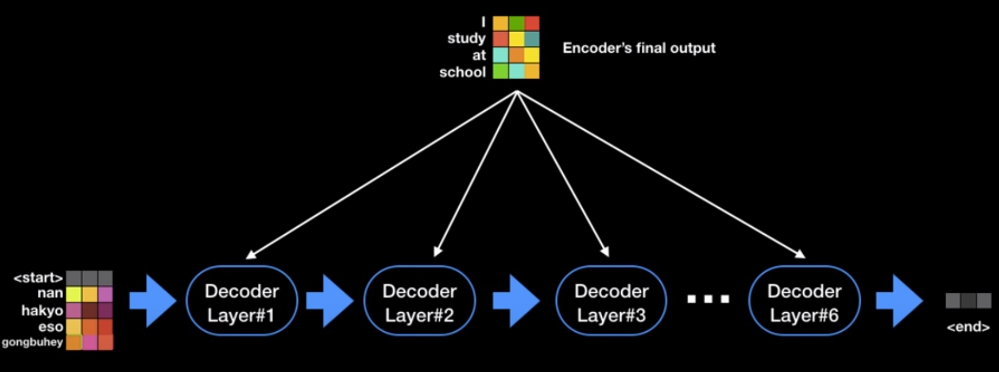

`Encoder`와 마찬가지로 여러 개의 `decoder` layder가 순차적으로 배열되어 있다.

### `Encoder` & `Decoder`

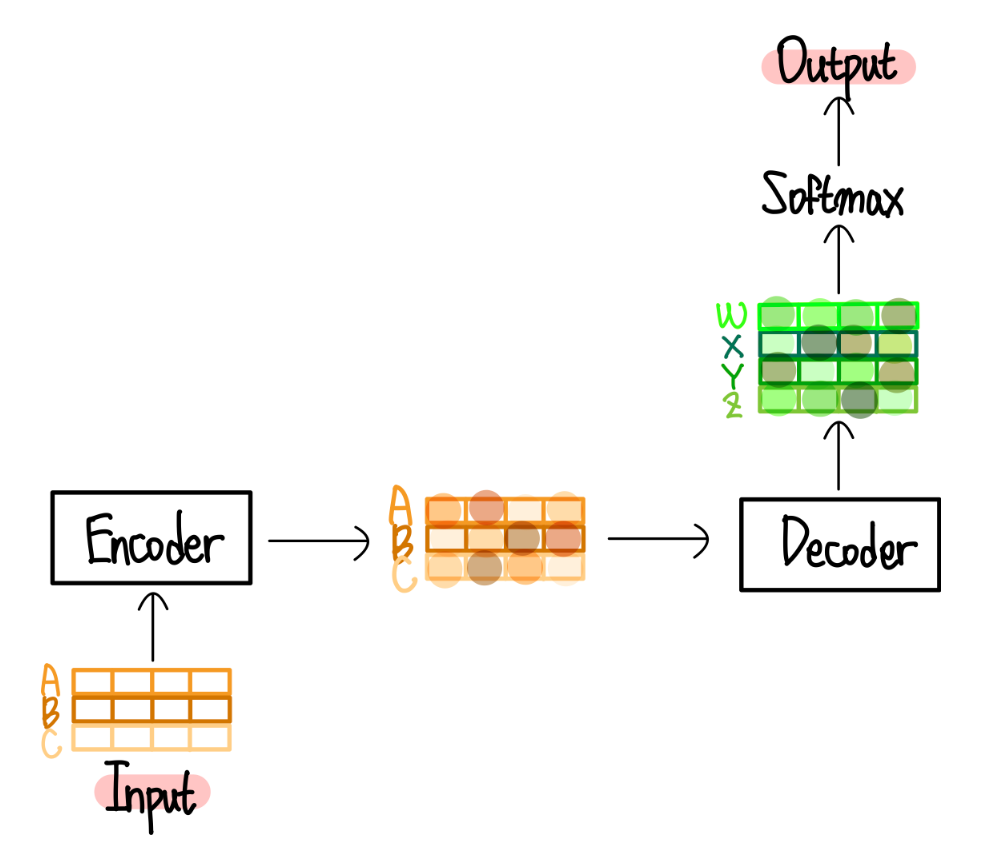

위의 그림을 보면, `Encoder`와 `Decoder` 는 모두 `self attention`이 적용된 정보를 출력한다. 

### `Transformer`

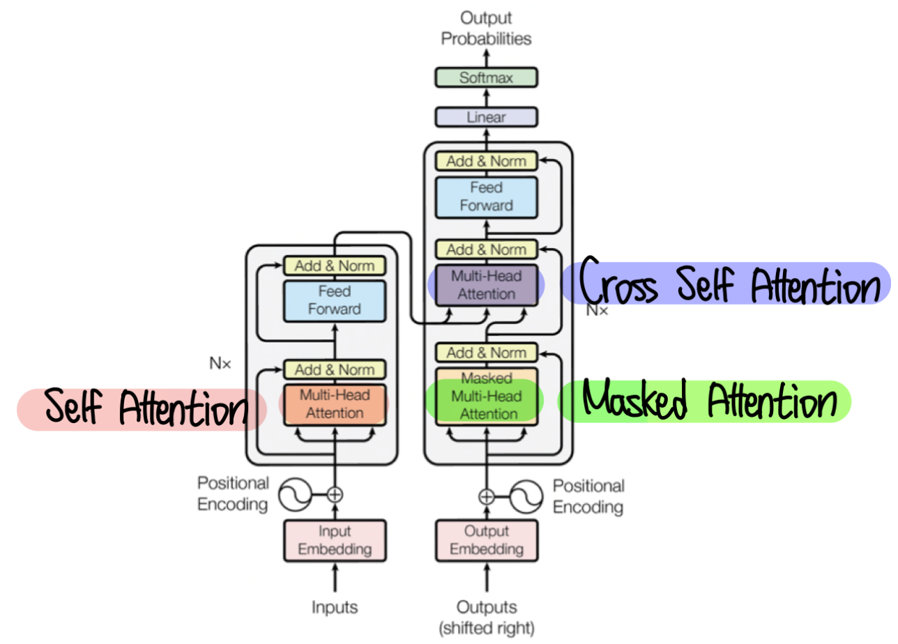

> `Decoder`의 `Multi Head Attention`은 `Attetion` layer가 적용된다.


### `Self Attention`의 이점

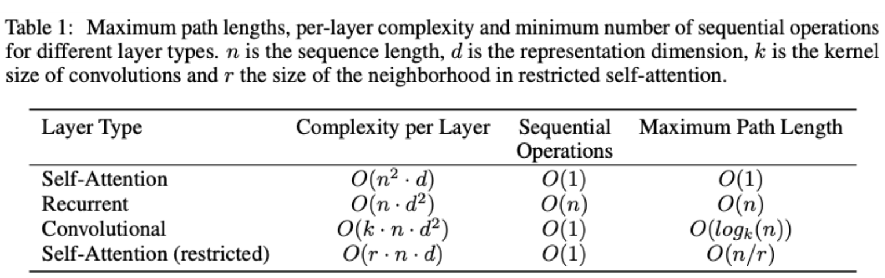

1. 계산량이 작다
2. sequential operation이 더 작다
3. 입력 데이터가 길더라도 어떤 위치에서든 `self attention`은 모든 위치에 대해서 동일한 path length를 갖는다. 즉, 아무리 멀리 떨어진 단어라도 `self attention`을 계산하는 복잡도는 동일하다.

### Model Variations by ablation

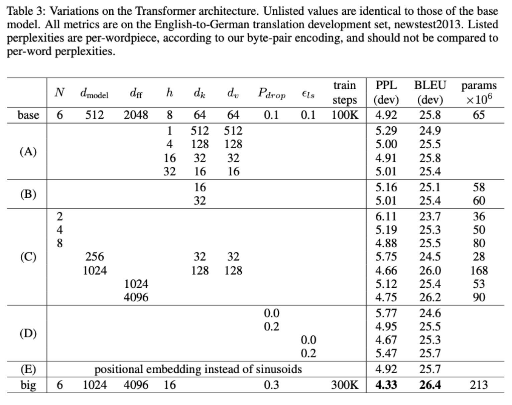

1. A 결과를 통해 적당한 Head 개수를 가질때 성능이 가장 좋음을 알 수 있습니다.
2. B 결과를 통해 Attention Key Size를 줄이면 모델의 성능이 크게 하락함을 알 수 있습니다.
3. C,D 결과를 통해 사이즈가 큰 모델의 성능이 좋고, Dropout은 Overfitting을 완화해줌을 알 수 있습니다.
4. E 결과를 통해 Learned Positional Encoding을 사용해도 결과가 비슷함을 알 수 있습니다.

### 장/단점

1. 장점
- 첫 번째로 입력 데이터를 한 덩어리로 처리하여 계산 속도를 크게 향상했습니다.
- 두 번째로 Self Attention을 사용하여 긴 데이터도 효과적으로 처리할 수 있습니다.
- 세 번째로 모델의 크기와 복잡성을 쉽게 조정할 수 있어 Scaling이 용이합니다.

2. 단점
- 첫 번째로 계산이 복잡합니다. Transformer는 많은 파라미터와 복잡한 구조를 가져, 큰 계산 리소스를 필요로 합니다.
- 두 번째로 긴 데이터를 처리할때 메모리 요구량이 급격하게 증가합니다.

## References:

- [Attention Is All You Need](https://arxiv.org/abs/1706.03762)

- [Illustrated Transformer](http://jalammar.github.io/illustrated-transformer/)

- [Simple tutorial in youtube](https://www.youtube.com/watch?v=mxGCEWOxfe8&list=PLVNY1HnUlO26qqZznHVWAqjS1fWw0zqnT&index=13&ab_channel=MinsukHeo%ED%97%88%EB%AF%BC%EC%84%9D)

- [attention tutorial](https://ffighting.net/deep-learning-basic/%eb%94%a5%eb%9f%ac%eb%8b%9d-%ed%95%b5%ec%8b%ac-%ea%b0%9c%eb%85%90/attention-and-self-attention-in-deep-learning/)